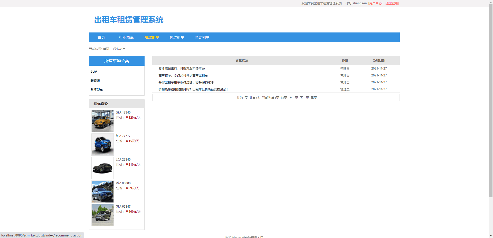
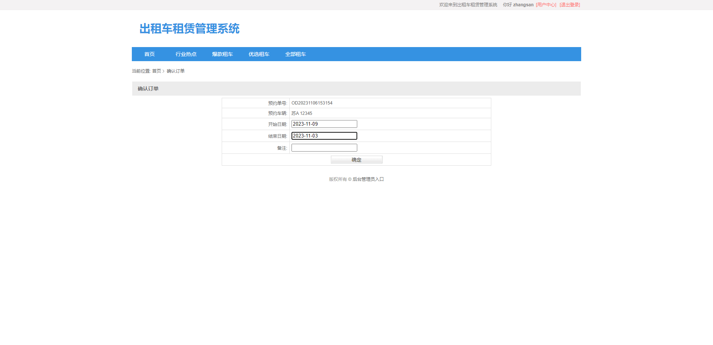
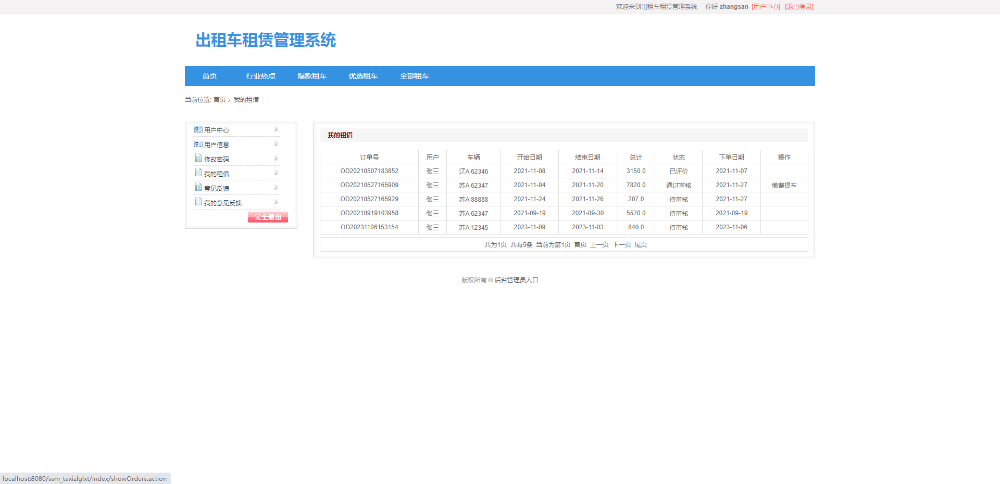
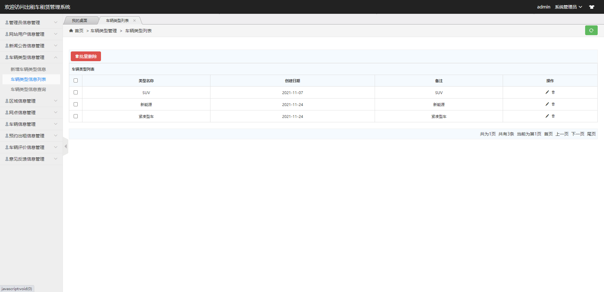
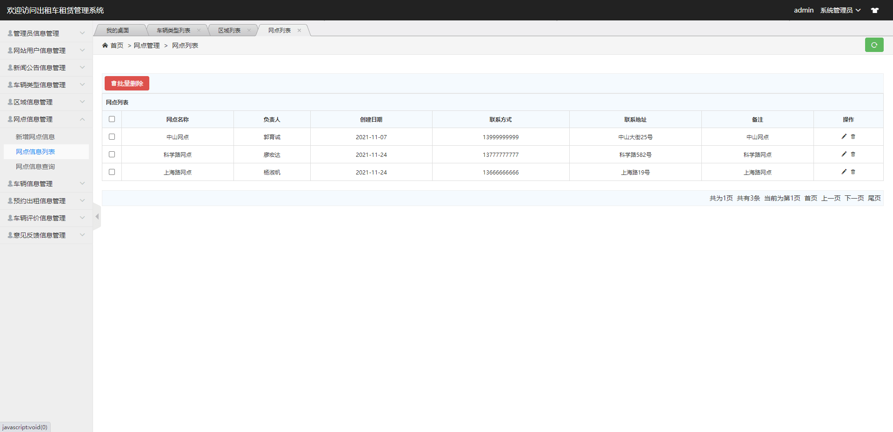
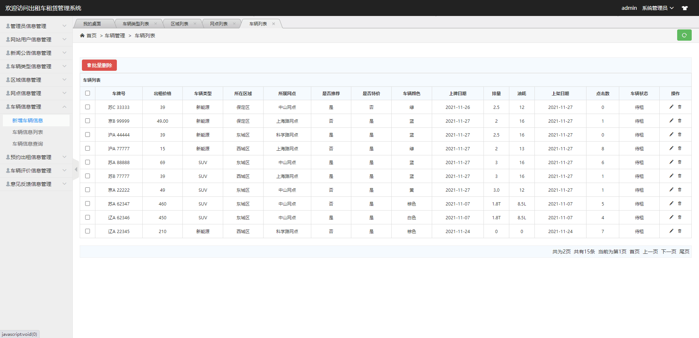

## 基于SSM的出租车租赁管理系统

- <b>完整代码获取地址：从戎源码网 ([https://armycodes.com/](https://armycodes.com/))</b>
- <b>技术探讨、资料分享，请加QQ群：692619798</b> 
- <b>作者微信：19941326836  QQ：952045282</b> 
- <b>承接计算机毕业设计、Java毕业设计、Python毕业设计、深度学习、机器学习</b>
- <b>选题+开题报告+任务书+程序定制+安装调试+论文+答辩ppt 一条龙服务</b>
- <b>所有选题地址 ([https://github.com/YuLin-Coder/AllProjectCatalog](https://github.com/YuLin-Coder/AllProjectCatalog)) </b>

## 项目介绍
基于SSM的出租车租赁管理系统，该系统共包含两种角色：用户、管理员，主要分为前台和后台两大模块。
1.前台模块
前台用户界面的实现，包括：前台首页、行业热点、爆款租车、优选租车、全部租车、用户注册、用户登陆、个人中心、我的租借、意见反馈、用户信息、修改密码等功能。
2.后台模块
主要是管理员对网站的管理功能，包括：管理员管理、用户信息管理、新闻公告管理、车辆类型管理、区域信息管理、网点信息管理、车辆信息管理、预约出租信息管理、车辆评价信息管理、意见反馈管理等功能。

## 项目技术
- 编程语言：Java
- 数据库：MySQL
- 前端技术：JSP、JavaScript、bootstrap、JQuery
- 后端技术：Spring、SpringMVC、MyBatis

## 运行环境
- JDK版本：JDK1.8及以上
- 开发工具：IDEA、Ecplise、Myecplise都可以
- 数据库: MySQL5.7及以上
- Maven：maven3.0及以上

## 运行截图

